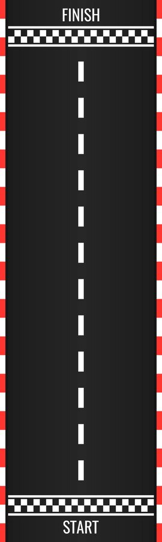

[python] Here’s a sample `README.md` for your hand-gesture-controlled car racing game:

---

# Hand Gesture Controlled Car Racing Game

This project is a Python-based car racing game where the player controls the car using hand gestures detected via a webcam. The game leverages OpenCV and MediaPipe for real-time hand tracking, while the game environment is powered by Pygame.

 <!-- You can add a screenshot of your game here. -->

## Features

- **Hand Gesture Control:** The car is controlled using real-time hand gestures detected via a webcam.
- **Obstacle Avoidance:** Dodge multiple obstacles as they come at you from the opposite lane.
- **Scoring System:** Earn points as you successfully avoid obstacles.
- **Dynamic Background:** Includes a track background to enhance the visual experience.

## How It Works

The game uses MediaPipe's pre-trained hand tracking model to detect hand landmarks in real-time. The position of your index finger determines the movement of the car:
- Move your finger to the left side of the screen to move the car left.
- Move your finger to the right side to move the car right.

## Installation

To run the game, follow these steps:

1. **Clone the Repository:**

    ```bash
    git clone https://github.com/your-username/hand-gesture-car-racing.git
    cd hand-gesture-car-racing
    ```

2. **Install Dependencies:**

    Install the required Python libraries:

    ```bash
    pip install pygame opencv-python mediapipe
    ```

3. **Add Required Assets:**

    Make sure the following images are present in the project directory:
    - `car.png`: The image for the player's car.
    - `obstacle.png`: The image for the obstacles.
    - `track.png`: The track background image.

4. **Run the Game:**

    Run the main script:

    ```bash
    python game.py
    ```

## Controls

- **Left Movement:** Move your index finger to the left side of the camera view.
- **Right Movement:** Move your index finger to the right side of the camera view.

## Gameplay

Your goal is to avoid the oncoming obstacles by controlling your car with your hand. The more obstacles you avoid, the higher your score!

## Dependencies

- **Python 3.x**
- **Pygame**: For rendering the game environment.
- **OpenCV**: For capturing the webcam feed.
- **MediaPipe**: For hand gesture detection.

## Future Enhancements

- Add more hand gestures for different controls.
- Include power-ups and additional levels.
- Implement a high-score leaderboard.

## Contributing

Feel free to fork this repository, make your improvements, and submit a pull request. Contributions are welcome!

## License

This project is licensed under the MIT License - see the [LICENSE](LICENSE) file for details.

---

### Notes:
- Update the GitHub repository link in the `git clone` command.
- Add your `track.png` or other relevant game preview images to showcase the project visually.

This `README.md` should help anyone get started with the project and provide clear instructions on how to set it up and play.
